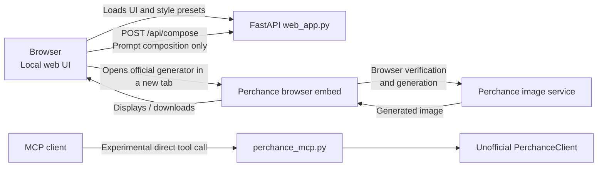

# Perchance Image Generator (b7kc35yv7u Replicant)

This project provides a local prompt-and-settings UI around **[perchance.org/b7kc35yv7u](https://perchance.org/b7kc35yv7u)**. The web UI creates links to Perchance's browser image generator; it does not proxy image traffic or collect generated image files on the local server.

---

## 1. How the Site & Connection Work

### Local App Architecture



The web UI opens Perchance's browser generator in a new tab, so each visitor completes Perchance's normal browser verification and receives images directly there. Perchance does not permit the image page to be framed by this localhost app. The Python/MCP client now falls back to a full Chrome session when the HTTP-only verification endpoint reports that the client is outdated.

Perchance generators are client-side templates hosted in iframes that communicate with a backend image generation service at `https://image-generation.perchance.org`. The service now requires browser-originated verification parameters, so direct HTTP-only clients are not reliable.

### The Connection Flow:

```
[Client / Browser]
       │
       ▼ (1) Full Chrome loads b7kc35yv7u and passes content/Turnstile checks
[Perchance Generator] ──► Provides userKey + adAccessCode in its browser request
       │
       ▼ (2) Browser-context POST /api/generate?userKey=...&adAccessCode=...
[Perchance Gen API]  ──► Dispatches prompt to GPU worker (FLUX.1-schnell / SDXL)
       │              ──► Returns: { status: "success", imageId: "...", imageDownloadUrl: "/api/downloadTemporaryImageViaProxy?..." }
       │
       ▼ (3) GET /api/downloadTemporaryImageViaProxy?...
[Perchance Image API]──► Returns raw JPEG binary
```

1. **Browser Verification**:
   - A full Chrome session loads the official generator and accepts its content-preferences gate.
   - The client captures the temporary `userKey` and `adAccessCode` from the generator's own request.
   - The HTTP-only verification path remains as a fast path for compatible responses, but the client automatically switches to full Chrome when Perchance returns `client_update_required`.
2. **Generation Request (`/api/generate`)**:
   - Accepts prompt, negative prompt, resolution (`512x512`, `512x768`, `768x512`, `768x768`), seed, and guidance scale.
3. **Image Retrieval**:
   - The API returns a signed temporary download URL (`imageDownloadUrl`) or direct image ID query (`/downloadTemporaryImage?imageId=<id>`).

---

## 2. How Settings and Workflows Work

| Setting | Type / Range | Description & Best Practices |
| :--- | :--- | :--- |
| **📝 Prompt** | Text | Core visual description. Parentheses increase weight: `(word)` (1.1x), `((word))` (1.2x), `(((word:1.5)))`. Perchance random syntax `{red\|blue}` is also supported. |
| **🚫 Negative Prompt** | Text | Elements to exclude (e.g. `bad anatomy, blurry, low quality, deformed hands, extra limbs`). |
| **🎨 Art Style** | 28 Presets | Injects custom prompt templates and negative prompts wrapping your input (e.g., *Realistic images*, *Realistic humans*, *Anime*, *MTG Card*). |
| **🔞 Adult Mode (+18)** | Toggle / Style | Unlocks NSFW art styles (*NSFW - Realistic*, *NSFW - Anime*, *NSFW Painted Anime*), appends mature tags, and strips anti-NSFW negatives. |
| **🎨 Art Style Mixing** | Preset | Secondary style combined into the final generation (e.g. *NSFW* adds `, nsfw`). |
| **🖼 Shape / Resolution**| `512x512`, `512x768`, `768x512`, `768x768` | Aspect ratio control. `512x768` is ideal for portraits; `768x512` is ideal for landscapes. |
| **✒️ Guidance Scale** | `1.0` - `30.0` (Default: `7.0`) | CFG Scale. Low values (1-4) give creative freedom; high values (>12) strictly follow prompt; 7.0 provides the optimal balance. |
| **🌱 Seed** | Integer (`-1` = random) | Deterministic generation. Reusing the same seed with identical parameters reproduces the exact image. |

---

## 3. How the Adult Option (+18) Works on b7kc35yv7u

In the generator `b7kc35yv7u`, adult features operate at three levels:

1. **Art Style Presets**:
   - **`NSFW - Realistic`**:
     - *Prompt addition*: `[input.description], highly realistic, realistic portrait, (nsfw), anatomically correct, realistic photograph, real colors, award winning photo, detailed face, realistic eyes, beautiful, sharp focus, high resolution, volumetric lighting, incredibly detailed, masterpiece...`
     - *Negative additions*: Explicitly filters out 3D renders, anime sketches, low-quality artifacts, and mutated limbs.
   - **`NSFW - Anime`**:
     - *Prompt addition*: `[input.description], intricate detail, hyper-anime, trending on artstation, 8k, fluid motion, stunning shading, anime, highly detailed, realistic, (nsfw), dramatic lighting...`
   - **`NSFW - Realistic (Stronger)` / `NSFW - Anime (Stronger)`**: Uses weighted triple parentheses `(((nsfw)))`.
   - **`NSFW Painted Anime`**: Injects painterly Pixiv/WLOP aesthetic with `((NSFW))`.
2. **Art Style Mixing**:
   - Selecting `NSFW` in mixing appends `, nsfw` to the prompt.
3. **Client-Side Content Guard**:
   - When the backend returns `maybeNsfw: true`, Perchance's iframe displays a `#contentGuardEl` blur.
   - The backend API **never censors or blocks** the image; the blur is purely client-side and can be toggled or disabled.

---

## 4. Usage Options

### Option A: Python CLI
Generate images directly from your terminal:

```bash
# SFW Realistic Portrait
python perchance_client.py --prompt "cyberpunk detective in rain" --style "Realistic images" --shape "512x768" --out "detective.jpeg"

# Adult Mode (+18) Generation
python perchance_client.py --prompt "fantasy sorceress casting spells" --style "NSFW - Realistic" --adult --shape "512x768" --out "sorceress.jpeg"

# List all 28 available art styles
python perchance_client.py --list-styles
```

The CLI requires Python 3.10+, the packages in `requirements.txt`, and Google Chrome or another full Chromium executable. See [INSTALLATION.md](INSTALLATION.md) for setup and troubleshooting.

### Option B: Web Application (1:1 UI Clone)
Start the local FastAPI web server:

```bash
python web_app.py
```
Open **`http://127.0.0.1:8000`** in your browser. You get:
- Real-time prompt generation
- Adult (+18) toggle switch
- 28 art styles with quick-add adult modifier pills
- Resolution & guidance scale sliders
- Live gallery with image download & NSFW reveal controls

### Option C: MCP Server (Model Context Protocol)
Integrate directly into Antigravity, Claude Desktop, Cursor, or any MCP client:

```bash
python perchance_mcp.py
```

The MCP server uses the same browser-backed fallback as the CLI. Keep Chrome installed on the machine where the MCP server runs.

**Exposed MCP Tools**:
- `generate_perchance_image(prompt, negative_prompt, art_style, art_style_mix, adult_mode, shape, guidance_scale, seed, output_filename)`
- `list_available_styles()`
- `get_style_info(style_name)`

**MCP Client Configuration (`claude_desktop_config.json` or Antigravity MCP settings)**:
```json
{
  "mcpServers": {
    "perchance": {
      "command": "python",
      "args": ["C:/ANTI/webgenimg/perchance_mcp.py"]
    }
  }
}
```
